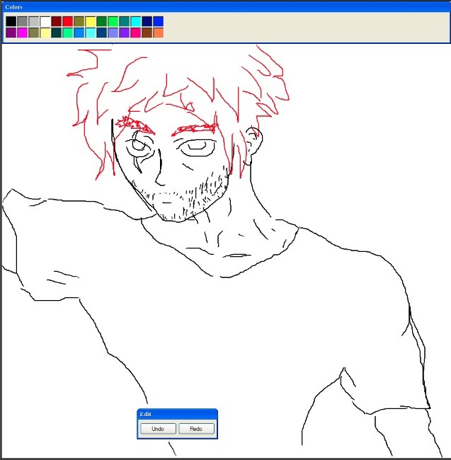

# React Paint




One day I was bored, and then I thought, how can I mix my crappy drawing skills, with my programming skills ?

and this is pretty much the whole story behind this project

## How to run

before running it you have to install the project's dependencies and the run the start script.

You can do this using yarn by typing

```
yarn && yarn start
```
or using npm with the following command
```
npm i && npm start
```

## Accessing it online

Instead of donwloading it and running locally, you can access it in [this link](https://priceless-chandrasekhar-fa1239.netlify.app/)
